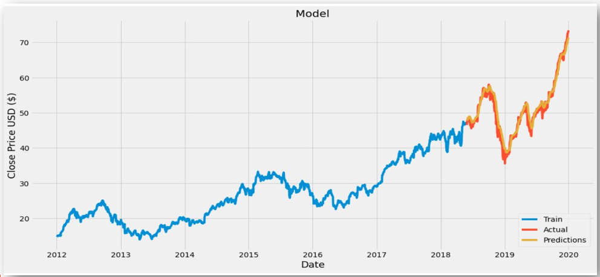

# Stock-Market-prediction-using-LSTM-model

This project proposes a closing price forecasting method for the most trending Apple data set based on the LSTM model combining some feature extraction techniques. To efficiently extract potential features from the data-set, a convolutional neural networks (CNN) is adopted in the initial part of the model. Latter, LSTM is used to predict the future stock price utilizing the extracted features. We also validated the LSTM model using technical important features such as the moving average and relative strength index of the stock.

#Expected Outcome

